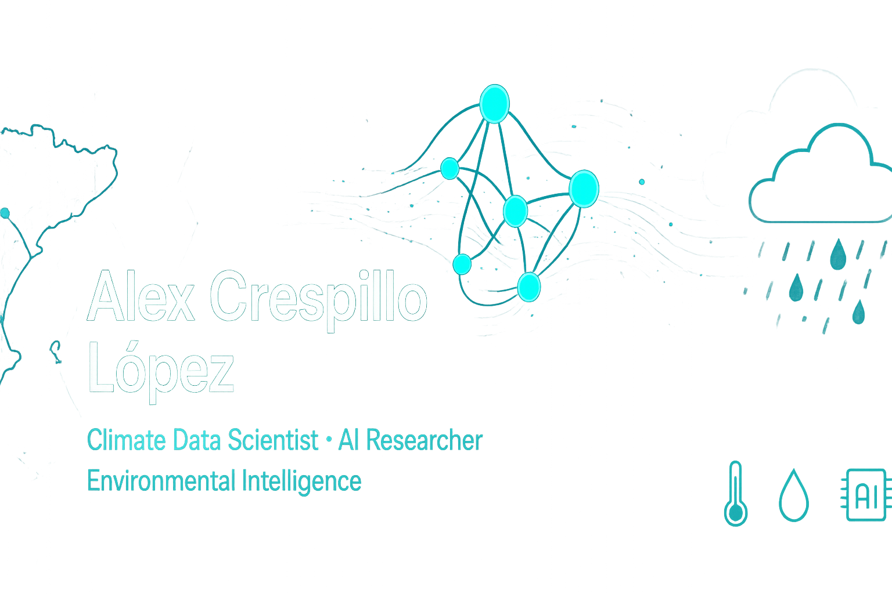

# Hi there 👋 I'm Alex Crespillo López

### 🌍 Climate Data Scientist | 🔬 Predoctoral Researcher | 🤖 AI Enthusiast

*"Understanding climate extremes through the lens of artificial intelligence and big data"*

---

## 🧑‍🔬 About Me

I'm a **Predoctoral Researcher** at the [Pyrenean Institute of Ecology (IPE-CSIC)](https://www.ipe.csic.es/) in Zaragoza, Spain, where I study **meteorological and hydrological droughts, heat waves, and their complex interactions** using cutting-edge **Artificial Intelligence** and **Big Data techniques**.

My research focuses on improving our understanding of drought–heatwave dynamics to enhance early warning systems and build climate resilience for the future.

### 🎯 Current Research
- **Meteorological & Hydrological Droughts** analysis and prediction
- **Heat Wave** characterization and propagation patterns
- **AI-driven climate modeling** and extreme event forecasting
- **Big Data approaches** to climate data analysis

---

## 🛠️ Tech Stack & Skills

### Programming Languages

### Data Science & Visualization

### GIS & Spatial Analysis

### Other Tools

---

## 🎓 Education

🎯 **Master's in Mathematical Engineering and HPC** | UNIR *(2025–present)*  
🌦️ **Master's in Meteorology** | University of Barcelona *(2022–2024)*  
🌍 **Bachelor's in Geology** | Autonomous University of Barcelona *(2018–2022)*

---

## 📊 GitHub Stats

  
  

---

## 📈 Recent Activity

<!--START_SECTION:activity-->
<!--END_SECTION:activity-->

---

## 📚 Latest Publications

- 📄 **Halifa Marin, A.**, et al. "Spatial Assessment of Dry-Spell Hazards in Spain: Toward an Operational Climate Service." *Water Scarcity and Drought* (2025) — **Coauthor**
- 📄 **Vicente-Serrano, S. M.**, et al. "An optimal and flexible approach for drought quantification based on standardized indices." *International Journal of Climatology* (2025) — **Coauthor**
- 📄 **Crespillo López, A.**, "Thermal inversion analysis in Andorra Central Valley and its relationship with pollutants and meteorological variables." *EMS Annual Meeting* (2024) — **Author**

---

## 🌍 International Experience

🇳🇴 **Research Stay in Tromsø, Norway** *(Mar–Jun 2024)*  
🇫🇷 **Academic Stays in France** *(Carcassonne, Toulouse, Bordeaux, Paris, and more)*

---

## 🗣️ Languages

🇪🇸 **Spanish** (Native) | 🏴 **Catalan** (Native) | 🇬🇧 **English** (B2) | 🇫🇷 **French** (B2)

---

## 🏆 Certifications & Training

- 🐍 **The Complete Python Developer** - Udemy
- 📊 **Complete R Course for Data Science and Machine Learning** - Udemy
- 🤖 **17th Machine Learning and Advanced Statistics Summer School** - UPM
- 📈 **Data Analytics and AI Bootcamp** - Upgrade Hub
- 🌡️ **IV Extremadura Congress of Climatology** - University of Badajoz

---

## 🎯 Fun Facts

- 🏔️ I love exploring mountains and nature
- 🍳 Passionate about cooking and trying new recipes
- ✈️ Travel enthusiast with a keen eye for different cultures
- 📚 Always learning something new in climate science and AI
- 🌱 Advocate for climate resilience and environmental sustainability

---

### 💭 *"Climate data is not just numbers—it's the story of our planet's future"*

**🌟 Let's collaborate on climate science and AI projects! 🌟**

---

  

